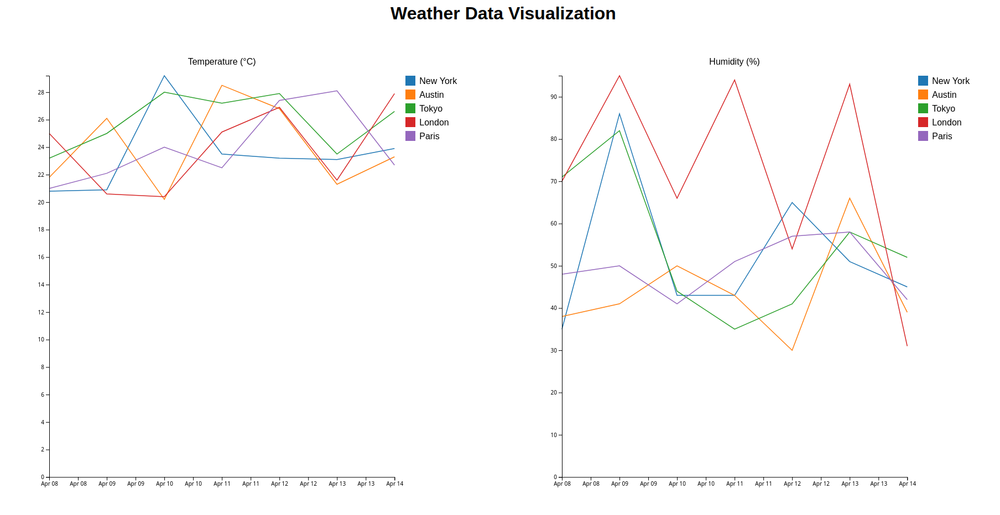

# Simple Weather Data Integration

This project simulates the integration of a third-party reporting tool (OpenWeatherMap API) with a data system. It includes an end-to-end ETL pipeline that extracts weather data, transforms it using Apache Spark, and loads it into a PostgreSQL database. Following (Weather Data Integration Pipeline)[https://github.com/bitsbard/weather-data-integration] project.

## Overview

1. Extracts data from OpenWeatherMap API
2. Transforms the raw data using Apache Spark
3. Loads the processed data into PostgreSQL databse
4. Orchestrates the entire ETL process using Apache Airflow

## Features

- API data extraction using the Requests library
- Big data transformation using Apache Spark
- Data loading into PostgreSQL using Spark JDBC
- ETL workflow orchestration with Apache Airflow

## Data Visualization

## Summary

In this project, the ETL process is orchestrated using Apache Airflow, allowing for scheduled, repeatable workflows. The project structure separate modules for extraction (api_client.py), transformation (data_transformer.py), and loading (data_loader.py). For data visualization, a Flask web app utilizes SQLAlchemy and Pandas to query and serve weather data from the database. This architecture demonstrates scalability and maintainability, key aspects of production-grade data engineering solutions, particularly in big data environments.